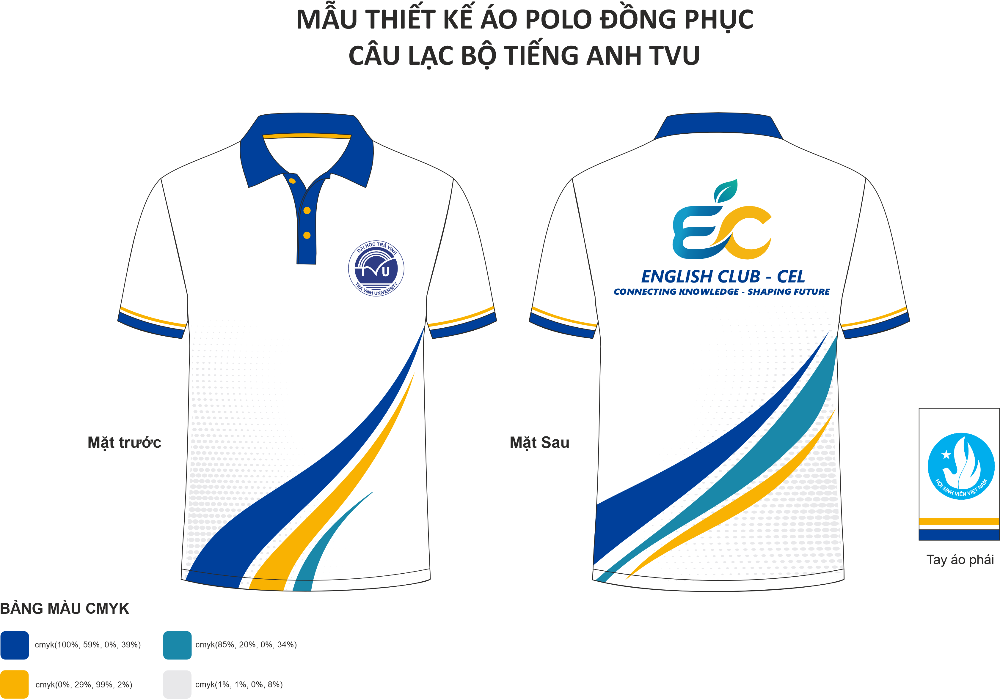
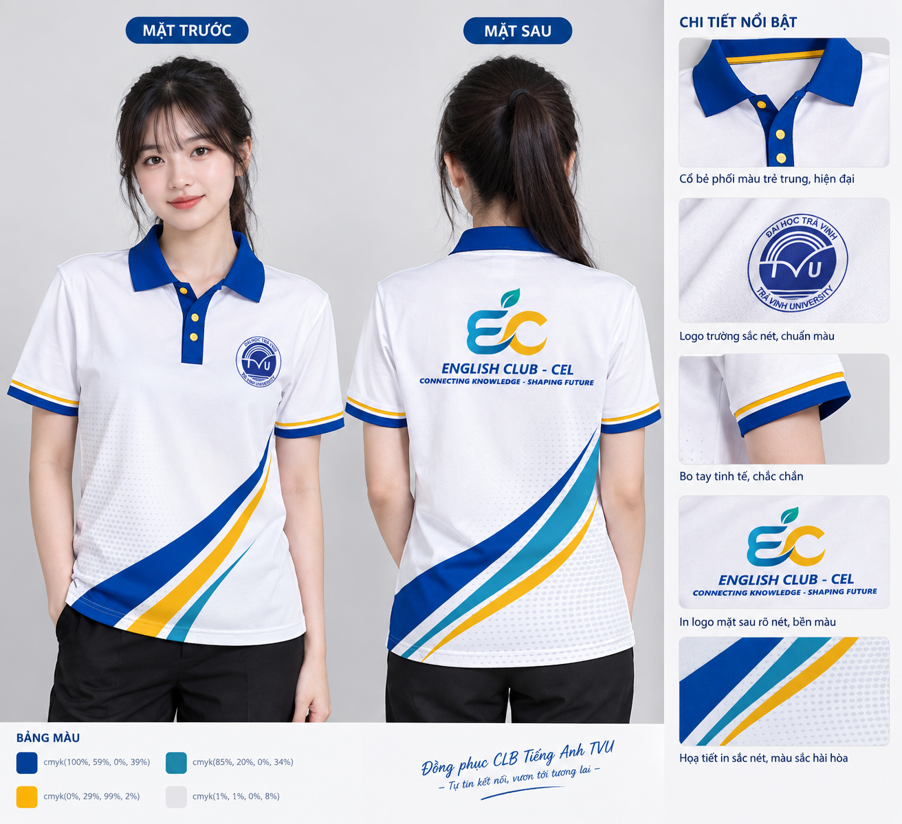
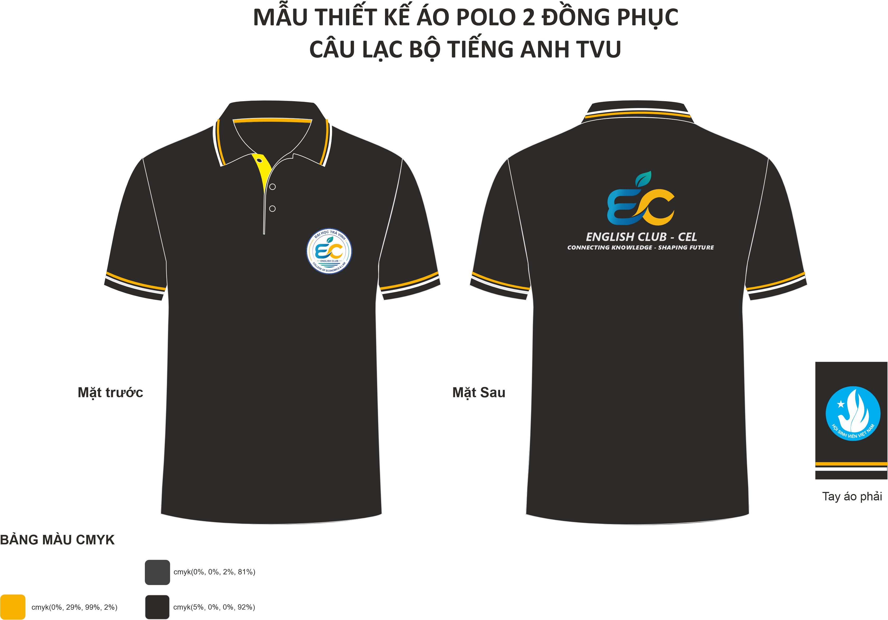
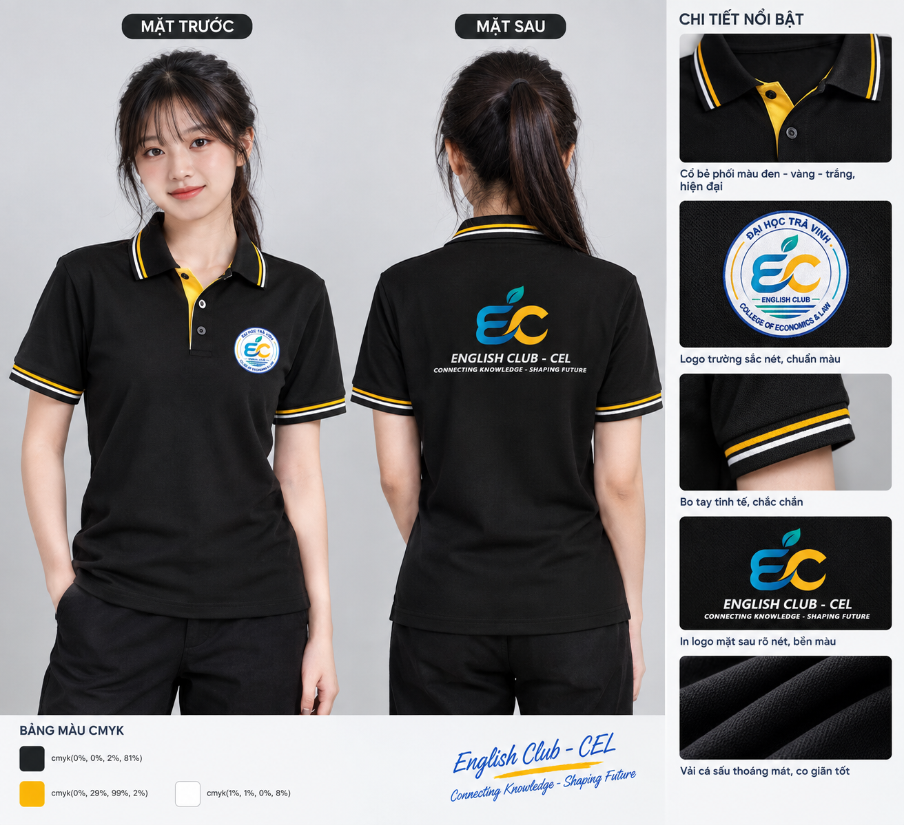

# English Club

---

## Giới thiệu

Kho lưu trữ này chứa toàn bộ **hệ thống nhận diện** và **mẫu thiết kế áo đồng phục** của Câu lạc bộ Tiếng Anh (English Club — EC), trực thuộc Trường Kinh tế - Luật, Đại học Trà Vinh. Thiết kế: **Nam Trần**.

## Cấu trúc thư mục

| Thư mục | Nội dung |
|---|---|
| [`Logo-CLB/`](Logo-CLB/) | Bộ nhận diện: logo, bảng màu, banner, bản vector `ESP-PDF/` |
| [`Ao-CLB/Light/`](Ao-CLB/Light/) | Áo polo trắng — thiết kế `Ao-CLB.png/.pdf`, render `Render-ao.png` |
| [`Ao-CLB/Dark/`](Ao-CLB/Dark/) | Áo polo đen — thiết kế `Ao-CLB.png/.pdf`, render `Render-ao.png` |

> File nguồn `.cdr` không đưa lên Git.

---

## 1. Logo Câu lạc bộ

### 1.1 Logo chính

### 1.2 Hai phiên bản rút gọn

Dùng cho không gian nhỏ như ảnh đại diện mạng xã hội, ấn tệp nhỏ hoặc hình mờ.

| Kèm dòng chữ | Chỉ biểu tượng EC |
|---|---|
|  |  |

### 1.3 Bản vector để in ấn

| Phiên bản | Tệp EPS | Tệp PDF |
|---|---|---|
| Logo chính (dạng tròn) | [`EC-logo-main.eps`](Logo-CLB/ESP-PDF/EC-logo-main.eps) | [`EC-logo-main.pdf`](Logo-CLB/ESP-PDF/EC-logo-main.pdf) |
| Logo rút gọn 1 | [`EC-logo-simple1.eps`](Logo-CLB/ESP-PDF/EC-logo-simple1.eps) | [`EC-logo-simple1.pdf`](Logo-CLB/ESP-PDF/EC-logo-simple1.pdf) |
| Logo rút gọn 2 | [`EC-logo-simple2.eps`](Logo-CLB/ESP-PDF/EC-logo-simple2.eps) | [`EC-logo-simple2.pdf`](Logo-CLB/ESP-PDF/EC-logo-simple2.pdf) |

---

## 2. Bảng màu và ý nghĩa biểu tượng

### 2.1 Bảng màu CMYK

| Màu | Thông số CMYK | Ý nghĩa |
|---|---|---|
| Xanh dương đậm | `cmyk(79%, 55%, 0%, 36%)` | Màu nhận diện chính — kết nối và tri thức |
| Xanh dương | `cmyk(94%, 44%, 0%, 42%)` | Màu phụ — tính động |
| Xanh ngọc | `cmyk(83%, 23%, 0%, 36%)` | Màu phụ |
| Xanh lơ | `cmyk(72%, 19%, 0%, 24%)` | Màu phụ |
| Xanh lá (chuyển sắc) | `cmyk(70%, 0%, 13%, 20%)` | Lá cây — sức sống |
| Vàng | `cmyk(0%, 28%, 97%, 2%)` | Màu nhấn — năng động và lạc quan |
| Xám | `cmyk(1%, 1%, 0%, 8%)` | Màu nền trung tính |

### 2.2 Ý nghĩa các thành phần

| Thành phần | Ý nghĩa |
|---|---|
| Chữ **E** và **C** | Viết tắt của *English Club*; nét chữ cách điệu liền mạch gợi dòng chữ tiếng Anh |
| Chiếc lá | Tăng trưởng, sức sống và phát triển bền vững |
| Nét vàng | Năng động, sáng tạo và sự nhiệt huyết |
| Nét xanh | Kết nối và tri thức |
| Đường sóng | Giao tiếp, kết nối và hội nhập |

---

## 3. Thiết kế áo đồng phục

### 3.1 Mẫu áo polo màu trắng

#### Bản thiết kế

Tải bản PDF: [`Ao-CLB/Light/Ao-CLB.pdf`](Ao-CLB/Light/Ao-CLB.pdf)

#### Ảnh render thực tế

Hình ảnh áo đồng phục đã hoàn thiện, gồm mặt trước, mặt sau và các chi tiết nổi bật.

### 3.2 Mẫu áo polo màu đen

Phiên bản màu đen, giữ nguyên bộ nhận diện; cổ áo, nút áo và dải viền tay áo dùng màu nhấn vàng. Ống tay áo in huy hiệu *Hội sinh viên Việt Nam*.

#### Bản thiết kế

Tải bản PDF: [`Ao-CLB/Dark/Ao-CLB.pdf`](Ao-CLB/Dark/Ao-CLB.pdf)

#### Ảnh render thực tế

Hình ảnh áo đồng phục đã hoàn thiện, gồm mặt trước, mặt sau và các chi tiết nổi bật.

### 3.3 Bảng màu CMYK của áo trắng

| Màu | Thông số CMYK | Vị trí sử dụng |
|---|---|---|
| Xanh navy | `cmyk(100%, 59%, 0%, 39%)` | Cổ áo, viền tay áo, sọc trang trí |
| Xanh ngọc | `cmyk(85%, 20%, 0%, 34%)` | Sọc trang trí |
| Vàng | `cmyk(0%, 29%, 99%, 2%)` | Nút áo, viền, sọc trang trí |
| Xám nhạt | `cmyk(1%, 1%, 0%, 8%)` | Nền hoạ tiết chấm bi |

### 3.4 Bảng màu CMYK của áo đen

| Màu | Thông số CMYK | Vị trí sử dụng |
|---|---|---|
| Đen | `cmyk(0%, 0%, 2%, 81%)` | Thân áo |
| Vàng | `cmyk(0%, 29%, 99%, 2%)` | Nút áo, viền cổ, viền tay áo |
| Trắng | `cmyk(1%, 1%, 0%, 8%)` | Sọc trang trí viền |

---

## 4. Mẫu banner truyền thông

Banner mẫu giới thiệu bốn mảng hoạt động của câu lạc bộ: *English Skills, Events, Networking, Community*.

---

## 5. Logo liên quan

| Logo | Vị trí sử dụng | Kho lưu trữ |
|---|---|---|
| Đại học Trà Vinh | Logo tròn trên ngực trái | [LogoRemake/TVU](https://github.com/Namtran592005/LogoRemake/tree/main/TVU) |
| Hội Sinh viên Việt Nam | Huy hiệu trên ống tay áo | [LogoRemake/HSVVN](https://github.com/Namtran592005/LogoRemake/tree/main/HSVVN) |

---

## Liên hệ

**Người liên hệ:** Bùi Thị Thu Nga
**Điện thoại:** 0342356993
