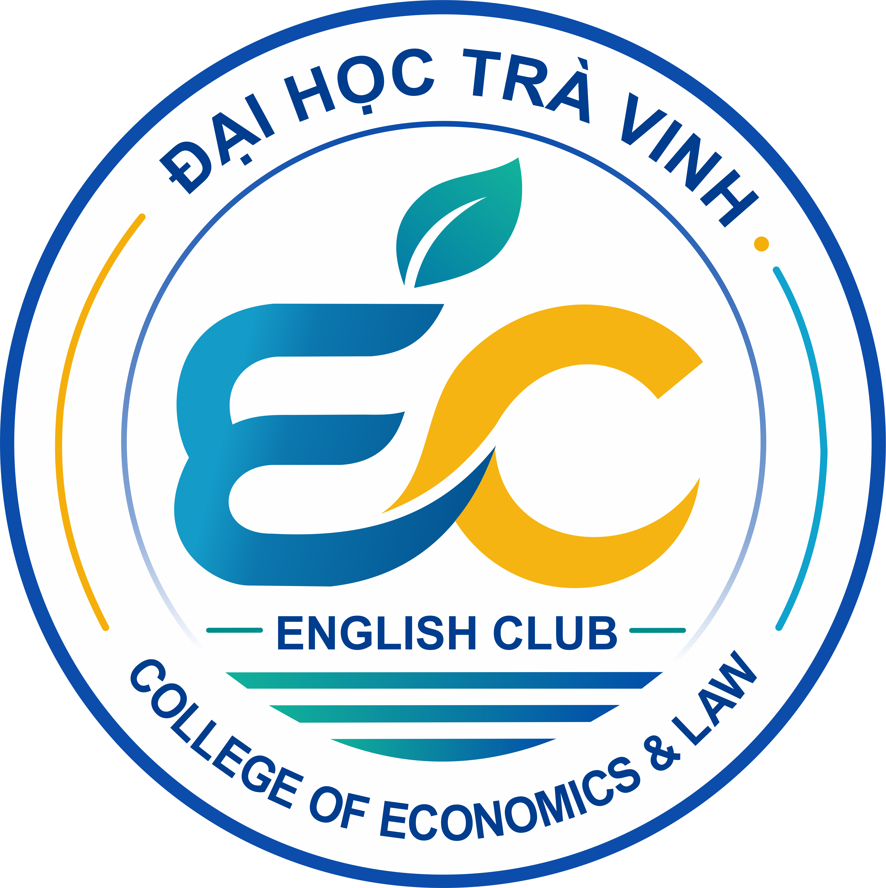
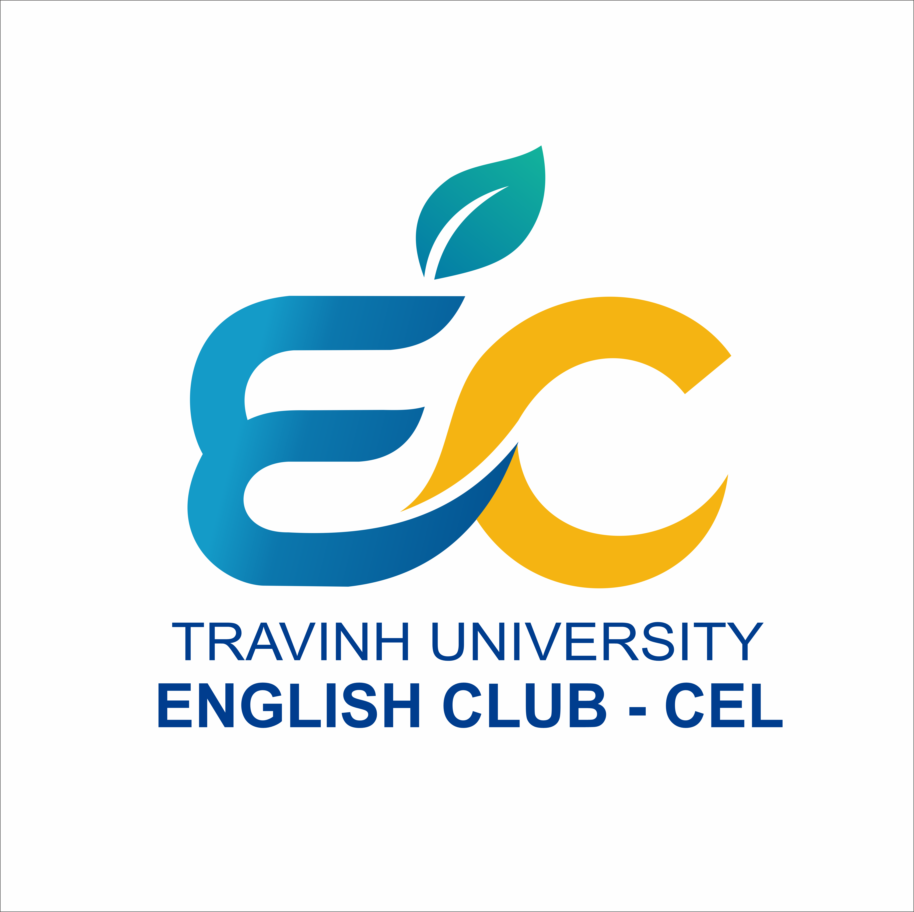
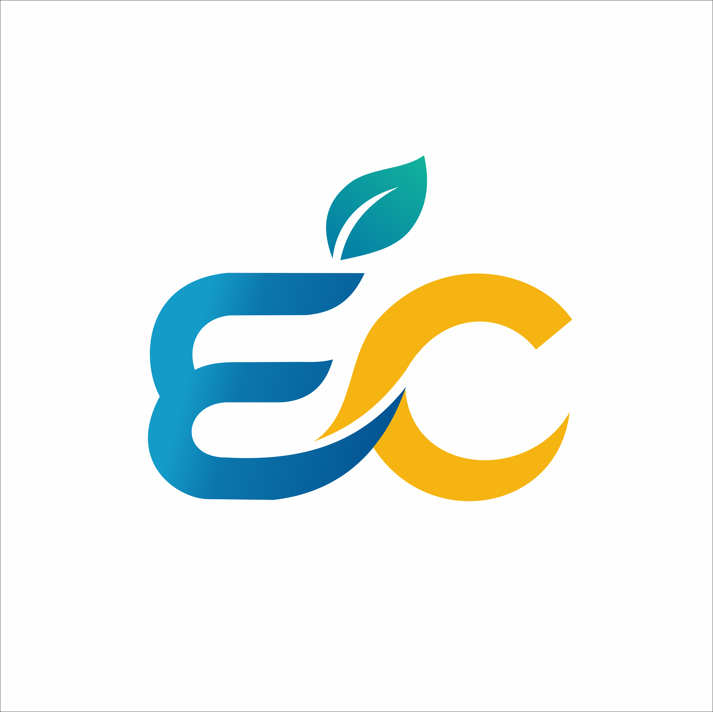
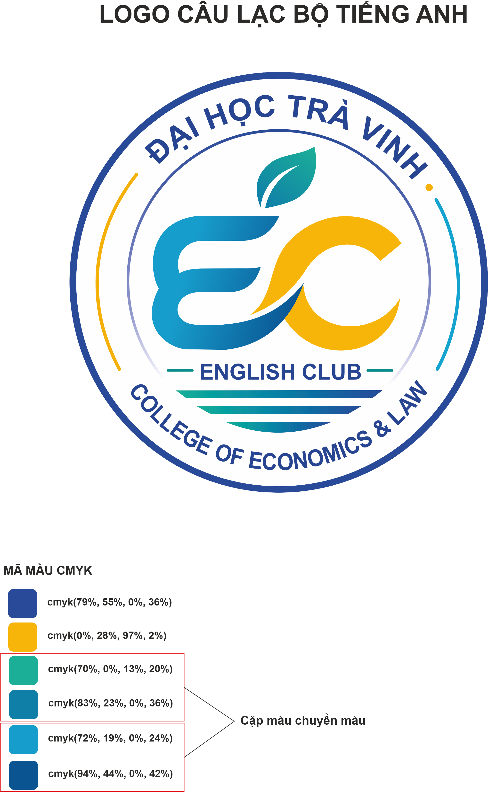
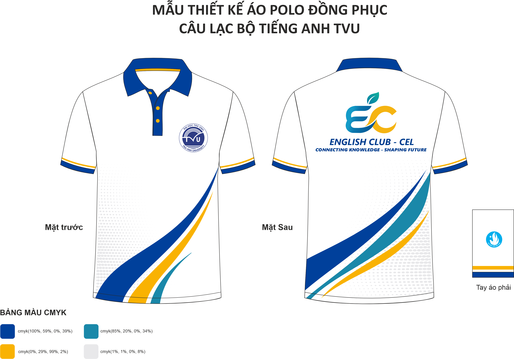

<div align="center">

# English Club — Bộ Nhận Diện & Đồng Phục

**CÂU LẠC BỘ TIẾNG ANH (EC)**
**TRƯỜNG KINH TẾ - LUẬT — ĐẠI HỌC TRÀ VINH**



</div>

---

## Giới thiệu

Kho lưu trữ này chứa toàn bộ **hệ thống nhận diện** và **mẫu thiết kế áo đồng phục** của Câu lạc bộ Tiếng Anh (English Club — EC), trực thuộc Trường Kinh tế - Luật, Đại học Trà Vinh.

| Thông tin | Nội dung |
|---|---|
| **Tên đơn vị** | Câu lạc bộ Tiếng Anh — English Club (EC) |
| **Đơn vị chủ quản** | Trường Kinh tế - Luật (College of Economics & Law — CEL) |
| **Trường** | Đại học Trà Vinh (Tra Vinh University — TVU) |
| **Người thực hiện thiết kế** | Nam Trần |

---

## Cấu trúc thư mục

```
English-Club/
├── Logo-CLB/                  # Bộ nhận diện
│   ├── EC-logo-1.png          # Logo chính (bản tròn đầy đủ)
│   ├── EC-logo-2.png          # Logo rút gọn kèm chữ
│   ├── EC-logo-3.png          # Logo rút gọn (chỉ biểu tượng EC)
│   ├── Docs.png / Docs.pdf    # Bảng màu CMYK và hướng dẫn sử dụng logo
│   ├── Banner.png             # Mẫu banner truyền thông
│   └── ESP-PDF/               # Bản vector để in ấn (EPS và PDF)
│       ├── EC-logo-main.eps / .pdf
│       ├── EC-logo-simple1.eps / .pdf
│       └── EC-logo-simple2.eps / .pdf
└── Ao-CLB/                    # Thiết kế áo đồng phục
    ├── Ao-CLB.png / Ao-CLB.pdf   # Mẫu áo polo đồng phục (mặt trước, mặt sau, tay áo)
    ├── Render-ao.png              # Ảnh render thực tế của áo
    └── *.cdr                      # File nguồn CorelDRAW (không đưa lên Git)
```

> **Lưu ý:** Các file nguồn `.cdr` (CorelDRAW) đã được loại khỏi Git bằng `.gitignore` vì là tệp nhị phân dung lượng lớn và không xem trực tiếp được trên GitHub. Khi cần chỉnh sửa hoặc bổ sung thiết kế, vui lòng liên hệ người thực hiện thiết kế.

---

## 1. Logo Câu lạc bộ

### 1.1 Logo chính

Bản logo tròn đầy đủ: vòng ngoài khuyết đặt tên **ĐẠI HỌC TRÀ VINH** và **COLLEGE OF ECONOMICS & LAW**; ở giữa là biểu tượng **EC** kết hợp hình chiếc lá, gợi ý sự phát triển bền vững.


### 1.2 Hai phiên bản rút gọn

Dùng cho không gian nhỏ như ảnh đại diện mạng xã hội, ấn tệp nhỏ hoặc hình mờ.

| Kèm dòng chữ *Tra Vinh University — English Club - CEL* | Chỉ biểu tượng EC |
|---|---|
|  |  |

### 1.3 Bản vector để in ấn

| Phiên bản | Tệp EPS | Tệp PDF |
|---|---|---|
| Logo chính (dạng tròn) | [`EC-logo-main.eps`](Logo-CLB/ESP-PDF/EC-logo-main.eps) | [`EC-logo-main.pdf`](Logo-CLB/ESP-PDF/EC-logo-main.pdf) |
| Logo rút gọn 1 | [`EC-logo-simple1.eps`](Logo-CLB/ESP-PDF/EC-logo-simple1.eps) | [`EC-logo-simple1.pdf`](Logo-CLB/ESP-PDF/EC-logo-simple1.pdf) |
| Logo rút gọn 2 | [`EC-logo-simple2.eps`](Logo-CLB/ESP-PDF/EC-logo-simple2.eps) | [`EC-logo-simple2.pdf`](Logo-CLB/ESP-PDF/EC-logo-simple2.pdf) |

---

## 2. Bảng màu và ý nghĩa biểu tượng



### 2.1 Bảng màu CMYK

| Màu | Thông số CMYK | Ý nghĩa |
|---|---|---|
| Xanh dương đậm | `cmyk(79%, 55%, 0%, 36%)` | Màu nhận diện chính — kết nối và tri thức |
| Xanh dương | `cmyk(94%, 44%, 0%, 42%)` | Màu phụ — tính động |
| Xanh ngọc | `cmyk(83%, 23%, 0%, 36%)` | Màu phụ |
| Xanh lơ | `cmyk(72%, 19%, 0%, 24%)` | Màu phụ |
| Xanh lá (chuyển sắc) | `cmyk(70%, 0%, 13%, 20%)` | Lá cây — sức sống |
| Vàng | `cmyk(0%, 28%, 97%, 2%)` | Màu nhấn — năng động và lạc quan |
| Xám | `cmyk(1%, 1%, 0%, 8%)` | Màu nền trung tính |

### 2.2 Ý nghĩa các thành phần

| Thành phần | Ý nghĩa |
|---|---|
| Chữ **E** và **C** | Viết tắt của *English Club*; nét chữ cách điệu liền mạch gợi dòng chữ tiếng Anh |
| Chiếc lá | Tăng trưởng, sức sống và phát triển bền vững |
| Nét vàng | Năng động, sáng tạo và sự nhiệt huyết |
| Nét xanh | Kết nối và tri thức |
| Đường sóng | Giao tiếp, kết nối và hội nhập |

---

## 3. Thiết kế áo đồng phục

Mẫu áo polo đồng phục của câu lạc bộ. Mặt trước in logo Đại học Trà Vinh; mặt sau in logo EC kèm dòng chữ nhận diện; tay áo có dải viền đồng phục.

### 3.1 Bản thiết kế



Tải bản PDF: [`Ao-CLB/Ao-CLB.pdf`](Ao-CLB/Ao-CLB.pdf)

### 3.2 Ảnh render thực tế

Hình ảnh áo đồng phục đã hoàn thiện, gồm mặt trước, mặt sau và các chi tiết nổi bật.


### 3.3 Bảng màu CMYK của áo

| Màu | Thông số CMYK | Vị trí sử dụng |
|---|---|---|
| Xanh navy | `cmyk(100%, 59%, 0%, 39%)` | Cổ áo, viền tay áo, sọc trang trí |
| Xanh ngọc | `cmyk(85%, 20%, 0%, 34%)` | Sọc trang trí |
| Vàng | `cmyk(0%, 29%, 99%, 2%)` | Nút áo, viền, sọc trang trí |
| Xám nhạt | `cmyk(1%, 1%, 0%, 8%)` | Nền hoạ tiết chấm bi |

---

## 4. Mẫu banner truyền thông

Banner mẫu giới thiệu bốn mảng hoạt động của câu lạc bộ: *English Skills, Events, Networking, Community*.


---

## Quy tắc sử dụng logo

1. Giữ nguyên tỷ lệ, không kéo méo hoặc tự ý đổi màu logo.
2. Chừa khoảng trắng xung quanh logo tối thiểu bằng chiều cao chữ **C**.
3. Khi thu nhỏ dưới **40 mm** (bản tròn) hoặc dưới **20 mm** (bản rút gọn), hãy chuyển sang dạng đơn sắc.
4. Nên đặt trên nền trắng hoặc nền xanh navy; hạn chế đặt trên nền có nhiều họa tiết.
5. Không kéo giãn, xoay, thêm hiệu ứng đổ bóng hoặc thay đổi phông chữ trong logo.

---

## Liên hệ

**Người liên hệ:** Bùi Thị Thu Nga
**Điện thoại:** 0342356993

---

<div align="center">

**Câu lạc bộ Tiếng Anh — Trường Kinh tế - Luật, Đại học Trà Vinh**

</div>
